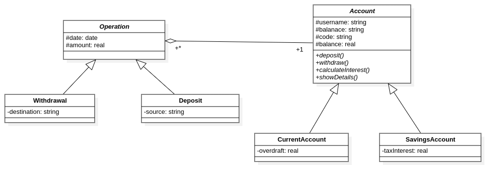

# Bankalik – Bank Account Management System

## Project Description

Bankalik is a **Java console application** that simulates a simple banking system.
The project is based on **Object-Oriented Programming (OOP)** principles and is structured into different layers for clarity and maintainability.

### Features

* Create different types of accounts:
  * **Savings Account** (with interest rate and withdrawal rules)
  * **Current Account** (with overdraft limit)
* Log into an existing account using **ID + account code** (CPT-XXXXX)
* Perform basic operations:
  * **Deposit**
  * **Withdrawal** (with validation rules)
* View account details (username, balance, operations history)
* Console-based user interface with menus and sub-menus
* In-memory storage

This project demonstrates:

* Abstraction (abstract classes and methods)
* Inheritance and polymorphism
* Overriding and overloading
* Exception handling (`try-catch`)
* Data validation with utility classes
* Usage of Java collections `HashMap`
* Java Time API for handling operation dates
* A simple DI Container for handling dependancy injection

---

## Technologies Used

* **Java 8+** (Core language)
* **Eclipse IDE** (Project setup and development)
* **Java Time API (`java.time`)** for date handling
* **Collections Framework (`HashMap`)** for in-memory storage

---

## Project Structure

```
src/
 ├── contract/               # Interfaces (abstractions for services, DI, etc.)
 │
 ├── main/
 │   └── App.java            # Main entry point (starts the application)
 │
 ├── model/
 │   ├── account/            # Account, SavingsAccount, CurrentAccount
 │   └── operation/          # Operation, Deposit, Withdrawal
 │
 ├── service/                # Business logic
 │   ├── AccountService.java
 │   └── OperationService.java
 │
 ├── ui/                     # Console-based user interface
 │   ├── ConsoleUIManager.java # Console based UI Manager implementation
 │   └── (main menus ,submenus, etc.)
 │
 └── util/                   # Utility classes
     ├── AccountValidator.java
     ├── Config.java       # Configuration (interest rates, overdrafts, etc.)
     └── DI.java              # Dependency Injection container
```

* **model/** → Core domain classes (accounts & operations)
* **service/** → Business logic layer (account management, login, etc.)
* **util/** → Utility classes (DI, validation, config)
* **ui/** → User interface layer (menus, inputs, outputs)

---

## Prerequisites

Make sure you have:

* **Java JDK 8 or higher** installed
* **Eclipse IDE** (or any other Java IDE)

Check Java version:

```bash
java -version
```

---

## How to Run

### 1. Setup in Eclipse

1. Open Eclipse
2. Create a new **Java Project** → Name it `Bankalik`
3. Inside `src/`, create the package structure (`model.account`, `model.operation`, `service`, `util`, `ui`)
4. Place each class into its respective package
5. Create a `App.java` inside `main` to start the application

```java
package main;

public class App {

	public static void main(String[] args) {
		IDIContainer container = new DI();

		container.register(IAccountService.class, new AccountService());
		container.register(IUIManager.class, new ConsoleUIManager());

		Menu menu = new Menu(
				container.resolve(IAccountService.class),
				container.resolve(IUIManager.class)
				);
		menu.boot(); // Boots the application
	}
}
```

### 2. Run .jar file directly

```bash
# Go inside the project directory
cd Bankalik

# Run
java -jar Bankalik.jar
```


### 3. Compile & Run Manually

```bash
# Go inside the project directory
cd Bankalik

# Create the output folder
mkdir out

# Compile
javac -d out -sourcepath src src/main/App.Java

# Run (entry point = main.App)
java -cp out main.App
```

---

## Screenshots

* Class Diagram


* App


